# PigGPT

## 超级简单的用户系统（白名单）

1. 添加/移除管理员
2. 添加/移除用户

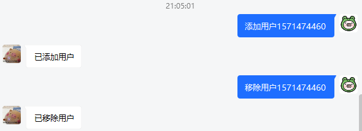

## 普通的ChatGPT对话

**（默认没有上下文记忆，需要手动输入“连续对话”开启）**

每人每天五次免费，完全免费真的没钱啦(;´Д`)，服务器api什么的都要钱钱。

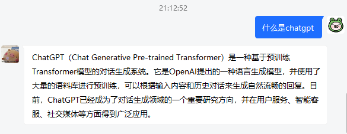

## 两种生成图像

1. openai（好像是DALL·E？好像炸了回来修修）

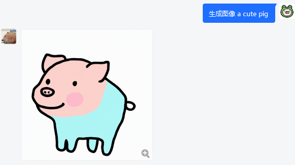

2. stable diffusion 二次元版本（一次好贵的，所以这个也限制五次👉👈）

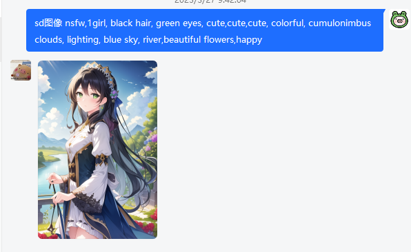

## 语音输入

就是说你直接跟他发语音就可以，他会自动识别并回复的， 目前只支持中文。

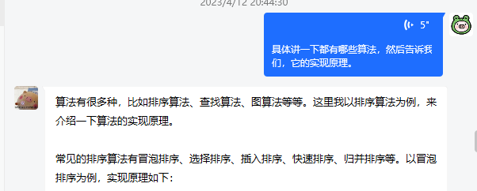

## 语音输出

### 微软语音

微软官方的语音，共八款发声人，特点是质量高，支持长文本。

~~其实还能加更多但是我懒了~~

使用方法：输入指令[.cm + 名称]，如“.cm晓晓”

| 名称 | 简介     | 名称 | 简介     |
| ---- | -------- | ---- | -------- |
| 晓晓 | 标准女声 | 晓依 | 少女     |
| 小北 | 东北女声 | 小妮 | 陕北女声 |
| 云间 | 标准男声 | 云希 | 营销号   |
| 云霞 | 正太     | 云阳 | 播音腔   |

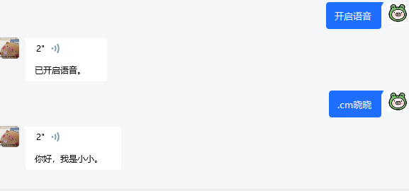

### vits语音包

vits在线推理，特点是可选的角色十分多，有原神崩坏三赛马娘什么的几百个，但是不能说太多话（免费显存太小），质量也不高。

~~只要有想要角色的模型啥都好说~~

使用方法：输入指令[.vm + 名称]/[查看角色]，如“.vm天依”“.vm派蒙”

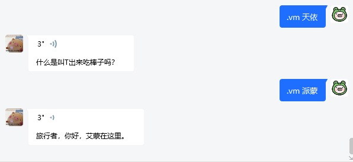

**点开下方网站中的可用人物一览：**

https://huggingface.co/spaces/zomehwh/vits-uma-genshin-honkai

## NewBing

就是对接newbing，指令输入注意大小写。

NewBing三种人格的设置方式 ，输入中括号内指令即可：

1. [newbing创造]
2. [newbing平衡]
3. [newbing精准]

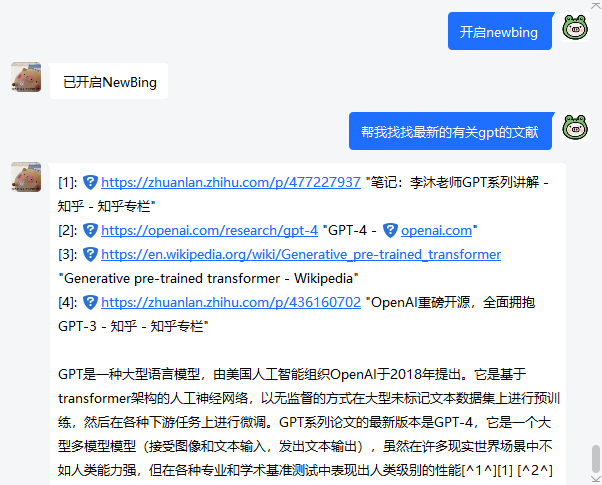

## 数学计算

数学计算支持输入中文、英文、甚至是比较标准的公式图片。（手写体识别率不行）

使用“/m ”+问题 输入，回答由**WolframAlpha**提供。

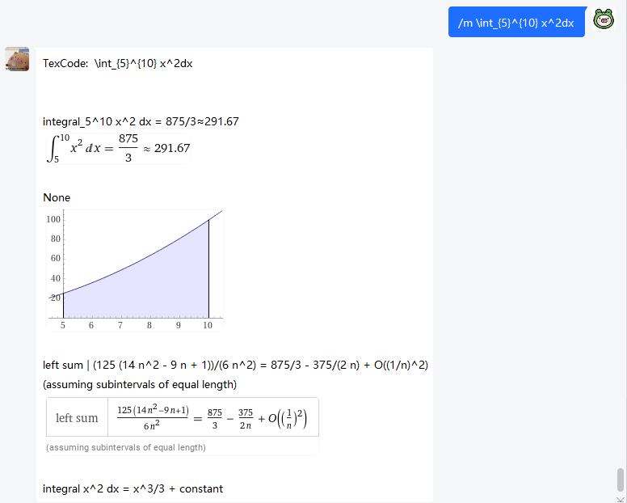

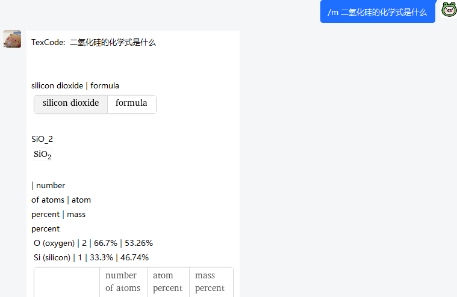

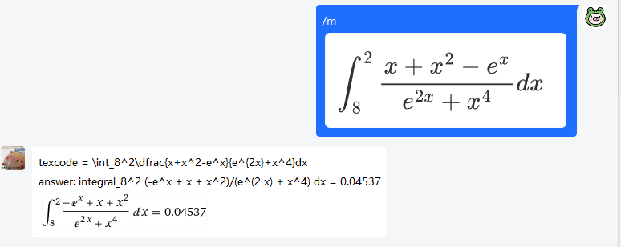

## 查询文献并下载

咕咕咕

## 未来计划

+ 自己训练一个更好的天依模型，或者其他语音包
+ 接入Google
+ 接入一些图片识别模型
+ 接入小模型，进行文本情绪分析进而实现发送表情包
+ 接入Wikipedia
+ 其他

~~已经整了爱发电了，但是感觉还是没有啥内容，就不贴链接了，想要了解可以私戳纯种猪QQ：2281717797~~
